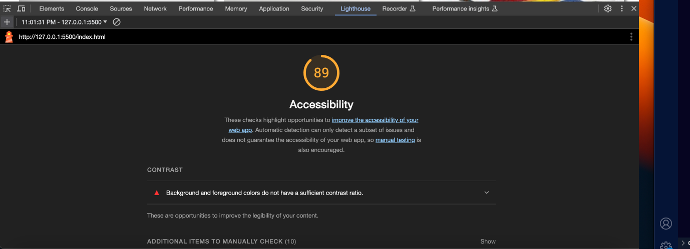

# LAB - Class 11

11.6.23

## Odd-Ducks

The code creates an interactive voting system where users can click on their preferred product, and it tracks the number of clicks and displays the results once the session ends (after 25 clicks).

### Author: Stephanie G Johnson

### Links and Resources

[Event Listeners](https://www.w3schools.com/js/js_htmldom_eventlistener.asp)

[Remove Event Listeners](https://developer.mozilla.org/en-US/docs/Web/API/EventTarget/removeEventListener)

[Click Events](https://developer.mozilla.org/en-US/docs/Web/API/Element/click_event)

[DOMContentLoaded event](https://developer.mozilla.org/en-US/docs/Web/API/Document/DOMContentLoaded_event)

[InnnerHTML](https://developer.mozilla.org/en-US/docs/Web/API/Element/innerHTML)

[Working with Objects](https://developer.mozilla.org/en-US/docs/Web/JavaScript/Guide/Working_with_objects)

### [Submission PR](https://stepheegee.github.io/odd-duck)

### Lighthouse Accessibility Report Score

### Comments

How did this go, overall?

This was tricky. I started off with the idea of having two constructors - one for the object of products/photos and one for the functionality - such as clicks. It didn't quite work out. It was too confusing. So I consolidated the constructors into one class. 

What really helped me with this lab was discussing, with ChatGPT, the steps in order that I needed to take for this lab, prior to beginning. I started off with instructions, which I captured in my notes folder. And roughly diagrammed a wireframe, which is also in the notes folder. That really helped me approach this in a procedural way. 

What observations or questions do you have about what you’ve learned so far?

I had a lot of difficulty with adding CSS styling to the actual JS code. See line 67 in my app.js file. I was able to get the shadowing effect. There were other effects that I wanted to try out but I just wasn't sure how to. 

How long did it take you to complete this assignment? And, before you started, how long did you think it would take you to complete this assignment?

It took me 7.5 hours to complete this. And that's pretty much how long I thought it would take, if not longer. 

